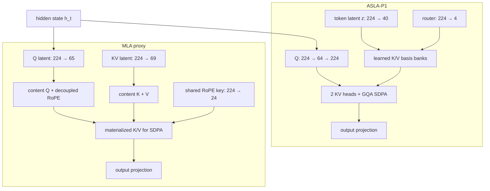

# ASLA-P1 vs MLA

A parameter-matched benchmark comparing an experimental **ASLA-P1** attention block with a **Multi-head Latent Attention (MLA)** proxy based on DeepSeek-V2.

This is a small experiment: ~9.28M parameters, three paired seeds, synthetic structured language-modeling data, and one Tesla T4.

The main result is a trade-off:

* ASLA-P1 has the lower mean eval loss and a smaller analytical compressed state.
* MLA is considerably faster in the current PyTorch implementation and is more consistent across seeds.

These results are not intended to establish which architecture is better at LLM scale.


## Results

| Metric                        |               ASLA-P1 |               MLA |
| ----------------------------- | --------------------: | ----------------: |
| Eval loss ↓                   |   **8.8053 ± 0.2605** |   8.9560 ± 0.0137 |
| Train throughput ↑            |          50,781 tok/s |  **67,953 tok/s** |
| Peak VRAM ↓                   |            1.1872 GiB |    **1.1824 GiB** |
| Tail CE std ↓                 |                0.1223 |       **0.08514** |
| Prefill p50 @ 2K ↓            |             13.155 ms |      **4.347 ms** |
| Analytical compressed state ↓ | **44 el/token/layer** | 93 el/token/layer |
| Total parameters              |             9,278,304 |         9,278,328 |

Paired eval-loss deltas, defined as `ASLA - MLA`:

```text
seed 1234   +0.00116
seed 2025   -0.45094
seed 3407   -0.00224
```

Seeds `1234` and `3407` are effectively ties. Most of the difference in mean eval loss comes from seed `2025`.

With only three seeds, this is not enough to claim a stable quality advantage.

Runtime results are less ambiguous for the code tested here. MLA reaches about 33.8% higher training throughput, and its 2K attention-only prefill latency is about 3.03× lower.

The implementation matters here. ASLA-P1 reconstructs routed K/V using generic PyTorch operations, including `einsum`, while MLA maps mostly to dense projections. The benchmark therefore measures the implementations in this repository rather than the best possible kernel for either architecture.

## Architecture




The backbone is identical between runs. Only the attention block changes.

The full models differ by 24 parameters:

```text
ASLA-P1   9,278,304
MLA       9,278,328
```

That is a difference of roughly `0.000259%`.

Layer-level details are in [`docs/architecture.md`](docs/architecture.md).

## Equations

### ASLA-P1

Each token is projected into a latent vector:

[
z_t=W_Zh_t
]

and a four-way routing distribution:

[
r_t=\mathrm{softmax}(W_Rh_t)
]

Keys and values are reconstructed from learned basis banks:

[
k_{t,h,j}=
\sum_{b=1}^{4}
\sum_{\ell=1}^{40}
z_{t,\ell}r_{t,b}B^K_{b,\ell,h,j}
]

[
v_{t,h,j}=
\sum_{b=1}^{4}
\sum_{\ell=1}^{40}
z_{t,\ell}r_{t,b}B^V_{b,\ell,h,j}
]

If decoding stores only the token latent and routing state:

[
C_{ASLA}=40+4=44
]

elements per token per layer.

### MLA proxy

The MLA proxy follows the low-rank KV path described in DeepSeek-V2:

[
c_t^{KV}=W^{DKV}h_t
]

[
k_t^C=W^{UK}c_t^{KV}
]

[
v_t^C=W^{UV}c_t^{KV}
]

For the dimensions used in this benchmark:

[
C_{MLA}=d_c+d_h^R=69+24=93
]

elements per token per layer.

The `44` and `93` values are analytical cache-state sizes. The current training and prefill implementations still materialize K/V before SDPA.

See [`docs/formulas.md`](docs/formulas.md) for the full notation.

## Benchmark setup

| Setting         |            Value |
| --------------- | ---------------: |
| GPU             |         Tesla T4 |
| PyTorch         |     2.10.0+cu128 |
| Precision       |         FP16 AMP |
| Layers          |                4 |
| `d_model`       |              224 |
| Query heads     |                4 |
| Head dim        |               56 |
| Vocabulary      |           32,000 |
| Sequence length |              256 |
| Batch size      |                8 |
| Steps           |            2,000 |
| Tokens per run  |        4,096,000 |
| Optimizer       |            AdamW |
| Learning rate   |             3e-4 |
| Weight decay    |             0.01 |
| Grad clip       |              1.0 |
| Seeds           | 1234, 2025, 3407 |

Both models use the same:

* data order;
* optimizer budget;
* RoPE configuration;
* paired seeds.

Eval cross-entropy excludes ASLA-P1's auxiliary routing and basis regularization terms.

The attention-only latency benchmark uses:

```text
sequence lengths: 64 → 2048
batch size:       2
warmup runs:      10
measured runs:    30
```

This measures prefill latency only. The frozen results do not include token-by-token autoregressive decode measurements.

See [`docs/methodology.md`](docs/methodology.md).

## What the benchmark shows

ASLA-P1 has two notable results in this run.

First, its analytical compressed state is smaller:

```text
ASLA-P1   44 elements/token/layer
MLA       93 elements/token/layer
```

Second, seed `2025` produces a noticeably lower eval loss for ASLA-P1.

That loss gap does not appear in the other two seeds, so it should not be treated as a robust quality result yet.

MLA performs better on the runtime side:

```text
higher training throughput
lower 2K prefill latency
lower tail CE variance
```

Peak VRAM is effectively tied at this model size.

The cache-state result and the runtime result should be treated separately. A smaller latent representation does not automatically produce a faster implementation. Routing, tensor contractions, memory movement, and kernel structure all affect wall-clock performance.

A shorter comparison is available in [`docs/asla-vs-mla.md`](docs/asla-vs-mla.md).

Paper notes and references are in [`docs/research.md`](docs/research.md).

## Radar chart

The radar chart uses six metrics:

* eval-loss quality;
* training throughput;
* 2K prefill latency;
* peak-VRAM efficiency;
* tail-loss stability;
* analytical cache efficiency.

For lower-is-better metrics:

[
score_i=\frac{\min_j x_j}{x_i}
]

For higher-is-better metrics:

[
score_i=\frac{x_i}{\max_j x_j}
]

This uses ratio-to-best rather than ordinary min-max scaling. With only two models, min-max scaling would otherwise map every comparison to `1` versus `0`, even when the raw difference is negligible.

Raw and normalized values are in [`results.csv`](results.csv).

## Limitations

This benchmark has several important limits:

* only three paired seeds;
* ~9.28M-parameter proxy models;
* synthetic structured LM data;
* no downstream code, reasoning, or long-context benchmark;
* no autoregressive decode-cache benchmark;
* compressed-state numbers are analytical rather than measured SDPA memory usage;
* ASLA-P1 has no fused kernel in this implementation;
* latency results are specific to the Tesla T4, PyTorch build, and SDPA backend used here;
* the rerun code reconstructs the benchmark setup but is not claimed to be bit-for-bit identical to the original notebook environment.

More detail is available in [`docs/limitations.md`](docs/limitations.md).

## Reproduce

Install the dependencies:

```bash
python -m pip install -r requirements.txt
```

Rebuild `results.csv` and the radar chart from the frozen raw results:

```bash
python scripts/reproduce.py
```

Rebuild the deterministic dataset:

```bash
python scripts/build_benchmark_cache.py
```

Run a smoke test:

```bash
python scripts/run_benchmark.py --profile smoke
```

Run the full paired benchmark on CUDA:

```bash
python scripts/run_benchmark.py --profile full --device cuda
```

New runs are written to:

```text
results/rerun/
```

The scripts do not overwrite:

```text
results/raw/
```

## Repository layout

```text
README.md
results.csv

assets/
  architecture.svg
  radar_tradeoff.png

docs/
  architecture.md
  formulas.md
  methodology.md
  asla-vs-mla.md
  limitations.md
  research.md
  validation.md

results/
  raw/
  figures/original/

scripts/
  build_benchmark_cache.py
  reproduce.py
  run_benchmark.py

src/
  config.py
  data.py
  models.py
  reporting.py
  scoring.py

tests/
```

## References

* DeepSeek-AI, **DeepSeek-V2: A Strong, Economical, and Efficient Mixture-of-Experts Language Model**
  https://arxiv.org/abs/2405.04434

* Tri Dao et al., **FlashAttention: Fast and Memory-Efficient Exact Attention with IO-Awareness**
  https://arxiv.org/abs/2205.14135

* Tri Dao, **FlashAttention-2: Faster Attention with Better Parallelism and Work Partitioning**
  https://arxiv.org/abs/2307.08691
