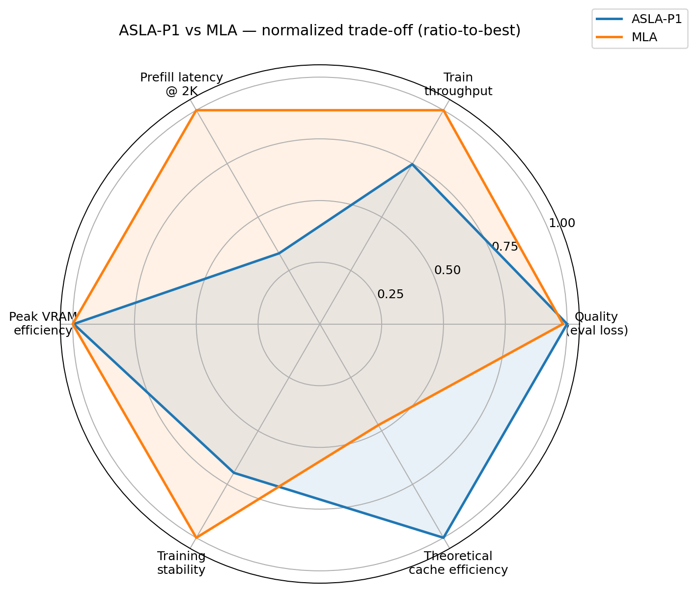
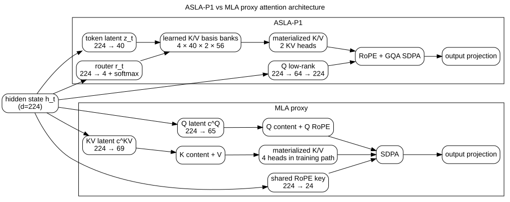
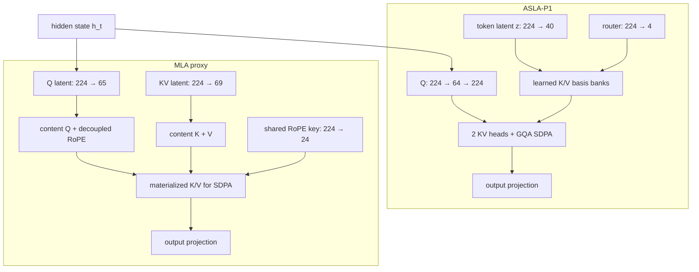

# ASLA-P1 vs MLA

This repo is a small, parameter-matched benchmark of two attention blocks: an experimental **ASLA-P1** implementation and a **Multi-head Latent Attention (MLA)** proxy based on DeepSeek-V2.

The useful part of the result is the trade-off. ASLA-P1 gets the lower mean eval loss in the frozen three-seed run and has a smaller analytical compressed state. MLA is much faster in the current PyTorch implementation, and its eval loss is far more consistent across seeds.

The experiment is deliberately small: about 9.28M parameters, three paired seeds, synthetic structured language-modeling data and one Tesla T4. I would not use it as evidence that either architecture wins at LLM scale.



## Results

| Metric | ASLA-P1 | MLA |
|---|---:|---:|
| Eval loss ↓ | **8.8053 ± 0.2605** | 8.9560 ± 0.0137 |
| Train throughput ↑ | 50,781 tok/s | **67,953 tok/s** |
| Peak VRAM ↓ | 1.1872 GiB | **1.1824 GiB** |
| Tail CE std ↓ | 0.1223 | **0.08514** |
| Prefill p50 @ 2K ↓ | 13.155 ms | **4.347 ms** |
| Analytical compressed state ↓ | **44 el/token/layer** | 93 el/token/layer |
| Total parameters | 9,278,304 | 9,278,328 |

The eval-loss mean needs context. The paired deltas `(ASLA - MLA)` are:

```text
seed 1234   +0.00116
seed 2025   -0.45094
seed 3407   -0.00224
```

Two seeds are basically ties. Seed `2025` accounts for most of the gap in the mean. With three seeds, that is an interesting signal, not a stable quality result.

On speed, the picture is clearer for this implementation. MLA trains about 33.8% faster and its 2K attention-only prefill latency is about 3.03× lower. ASLA-P1 currently builds routed K/V with generic PyTorch operations, including `einsum`; MLA maps mostly to dense projections. These numbers measure the code in this repo, not an optimized kernel ceiling for either design.

## Architecture





The backbone is identical between runs. Only the attention block changes. Parameter counts differ by 24 parameters over the full 9.28M-parameter model (`0.000259%`). See [`docs/architecture.md`](docs/architecture.md) for the layer-level breakdown.

## Equations

For ASLA-P1, each token gets a latent vector and a four-way routing vector:

\[
z_t=W_Zh_t,\qquad r_t=\mathrm{softmax}(W_Rh_t)
\]

K/V are reconstructed from learned basis banks:

\[
k_{t,h,j}=\sum_{b=1}^{4}\sum_{\ell=1}^{40}
z_{t,\ell}r_{t,b}B^K_{b,\ell,h,j}
\]

\[
v_{t,h,j}=\sum_{b=1}^{4}\sum_{\ell=1}^{40}
z_{t,\ell}r_{t,b}B^V_{b,\ell,h,j}
\]

If decode caches only `z_t` and the routing state, the analytical state is:

\[
C_{ASLA}=40+4=44
\]

The MLA proxy follows the low-rank KV path from DeepSeek-V2:

\[
c_t^{KV}=W^{DKV}h_t,\qquad
k_t^C=W^{UK}c_t^{KV},\qquad
v_t^C=W^{UV}c_t^{KV}
\]

With the dimensions used here, the latent plus decoupled-RoPE state is:

\[
C_{MLA}=d_c+d_h^R=69+24=93
\]

Those `44` and `93` values are analytical cache accounting. The training/prefill path still materializes K/V before SDPA. The full notation is in [`docs/formulas.md`](docs/formulas.md).

## Benchmark setup

Frozen run:

| Setting | Value |
|---|---:|
| GPU | Tesla T4 |
| PyTorch | 2.10.0+cu128 |
| Precision | FP16 AMP |
| Layers | 4 |
| `d_model` | 224 |
| Query heads | 4 |
| Head dim | 56 |
| Vocabulary | 32,000 |
| Sequence length | 256 |
| Batch size | 8 |
| Steps | 2,000 |
| Tokens per run | 4,096,000 |
| Optimizer | AdamW |
| Learning rate | 3e-4 |
| Weight decay | 0.01 |
| Grad clip | 1.0 |
| Seeds | 1234, 2025, 3407 |

Both models use the same data order, optimizer budget, RoPE profile and paired seeds. Eval cross-entropy does not include ASLA's auxiliary routing/basis regularization.

The attention-only latency test uses sequence lengths from `64` to `2048`, batch size `2`, 10 warmups and 30 measured repeats. It is a prefill benchmark. There is no token-by-token decode benchmark in the frozen result.

More detail: [`docs/methodology.md`](docs/methodology.md).

## ASLA-P1 / MLA readout

ASLA-P1 is interesting here for two reasons: the smaller analytical state (`44` vs `93` elements/token/layer), and one seed where its eval loss separates sharply from MLA. The other two seeds do not reproduce that quality gap.

MLA is easier on the current kernels. Its training throughput is higher, the 2K prefill path is much faster, and its tail cross-entropy varies less across the run. Peak VRAM is effectively a tie at this scale.

I would treat cache size and runtime as separate questions. A smaller latent state does not automatically imply a faster implementation, especially when one path uses routing and generic contractions while the other is mostly GEMM-friendly dense projection. This is consistent with the broader attention literature: memory traffic, work partitioning and kernel design can dominate wall-clock behavior even when the high-level arithmetic looks favorable.

See [`docs/asla-vs-mla.md`](docs/asla-vs-mla.md) for the compact comparison and [`docs/research.md`](docs/research.md) for paper references.

## Radar chart

The radar has six axes:

- eval-loss quality
- training throughput
- 2K prefill latency
- peak-VRAM efficiency
- tail-loss stability
- analytical cache efficiency

The score is ratio-to-best. For a lower-is-better metric:

\[
score_i=\frac{\min_j x_j}{x_i}
\]

For a higher-is-better metric:

\[
score_i=\frac{x_i}{\max_j x_j}
\]

This keeps small differences small. With only two models, ordinary min-max scaling would force every metric into `1` versus `0`, even when the raw values are nearly identical.

The exact inputs and normalized values are in [`results.csv`](results.csv).

## Limits of this benchmark

The main ones:

- three paired seeds;
- ~9.28M-parameter proxy models;
- synthetic structured LM data;
- no downstream suite such as code, reasoning or long-context evaluation;
- no real autoregressive decode cache benchmark;
- analytical compressed-state numbers are not the memory footprint of the current SDPA path;
- ASLA-P1 does not have a fused kernel here;
- all latency numbers are tied to a T4, this PyTorch build and its SDPA backend;
- the rerun implementation reconstructs the supplied benchmark setup, but is not claimed to be bit-for-bit identical to the original notebook environment.

[`docs/limitations.md`](docs/limitations.md) has the longer version.

## Reproduce the published artifacts

Install dependencies and rebuild `results.csv` plus the radar from the frozen raw files:

```bash
python -m pip install -r requirements.txt
python scripts/reproduce.py
```

Rebuild the deterministic dataset:

```bash
python scripts/build_benchmark_cache.py
```

Run a small smoke benchmark:

```bash
python scripts/run_benchmark.py --profile smoke
```

Run the full paired benchmark on CUDA:

```bash
python scripts/run_benchmark.py --profile full --device cuda
```

New benchmark output goes to `results/rerun/`. The scripts do not overwrite `results/raw/`.

## Files worth looking at

```text
README.md
results.csv
assets/
  architecture.svg
  radar_tradeoff.png
docs/
  architecture.md
  formulas.md
  methodology.md
  asla-vs-mla.md
  limitations.md
  research.md
  validation.md
results/
  raw/                 # frozen supplied evidence
  figures/original/    # original benchmark plots
scripts/
  build_benchmark_cache.py
  reproduce.py
  run_benchmark.py
src/
  config.py
  data.py
  models.py
  reporting.py
  scoring.py
tests/
```

## References

- DeepSeek-AI, **DeepSeek-V2: A Strong, Economical, and Efficient Mixture-of-Experts Language Model** — https://arxiv.org/abs/2405.04434
- Tri Dao et al., **FlashAttention: Fast and Memory-Efficient Exact Attention with IO-Awareness** — https://arxiv.org/abs/2205.14135
- Tri Dao, **FlashAttention-2: Faster Attention with Better Parallelism and Work Partitioning** — https://arxiv.org/abs/2307.08691
