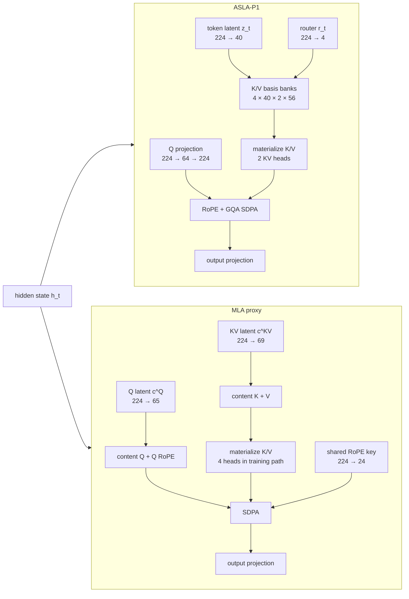

# Architecture

The Transformer backbone is fixed across both runs. The experiment only swaps the attention block.

ASLA-P1 reconstructs K/V from a 40-dimensional token latent and a four-way router over learned basis banks. The supplied P1 setup has two KV heads, then uses grouped-query attention for four query heads.

The MLA proxy compresses K/V into a shared latent, reconstructs content K/V, and keeps a separate RoPE key path. That follows the main MLA structure introduced in DeepSeek-V2, with dimensions chosen here to match ASLA-P1's parameter budget as closely as possible.

## Parameter match

| Item | ASLA-P1 | MLA |
|---|---:|---:|
| Attention params/layer | 124,544 | 124,550 |
| Total params | 9,278,304 | 9,278,328 |
| Total parameter delta | — | **0.000259%** |

A 24-parameter difference over the full model is small enough that capacity is unlikely to explain the runtime gap by itself.

The cache numbers used elsewhere in the repo should not be read from this diagram as measured memory. Both training/prefill paths materialize K/V for SDPA. The smaller latent-state figures are analytical decode-cache accounting; see [`formulas.md`](formulas.md) and [`methodology.md`](methodology.md).
